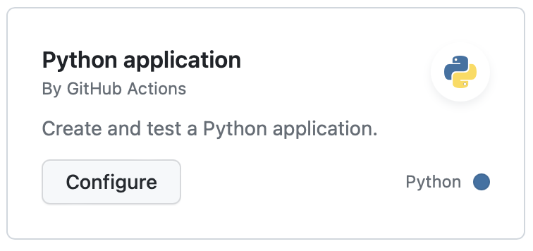

# Testing from the web browser

## Introduction

The coursework focus is on integration or system testing from a browser using Pytest and Selenium.

You can also include:

- unit tests of functions (covered in COMP0035)
- tests of Flask routes (covered in COMP0034 coursework 1)
- running the tests on a continuous integration platform, e.g., GitHub Actions (covered in COMP0035, with additional
  config for Flask/Dash apps covered in COMP0034)
- reporting on the extent to which the tests cover the application's cource code, called coverage (covered in COMP0035)

The focus of this testing is to test typical sequences of actions a user would carry out when using the app. A good
starting point is to look at your requirements (user stories, use cases). There is guidance in the week 9 lecture on
using these to determine test cases.

## Set up the testing environment

To set up the testing environment you need to:

- install your own code e.g. `pip install -e .` which in turn relies on your `pyproject.toml`
- install pytest
- install selenium
- install a chrome driver that matches your browser and
- a GitHub Actions workflow (if you plan to use the GitHub CI platform)

### Install selenium and pytest

[Selenium webdriver](https://www.selenium.dev/documentation/webdriver/) allows you to run tests automatically in the
browser, that is you simulate the behaviour of a user
carrying out specific actions in the browser and then use assertions to verify conditions or state.

Selenium can be used with several test libraries. pytest is recommended in the Dash and Flask documentation.

Install selenium and pytest, e.g.: `pip install selenium pytest`

### Install chromedriver

Selenium requires a driver that handles the browser interactions. Drivers are available for Chrome, Firefox etc. For the
coursework please use Chrome to facilitate marking. Dash testing only supports Chrome and Firefox geckodriver.

The [Chromedriver documentation](https://chromedriver.chromium.org/downloads/version-selection) explains options for
installation.

## Set up GitHub Actions

Setting up a workflow was covered in COMP0035 and is not repeated. You can refer to
the [GitHub documentation](https://docs.github.com/en/actions/automating-builds-and-tests/building-and-testing-python).

Go to Actions tab in GitHub Actions and you will see starter workflows. The Python Application starter workflow is close
to what you need so is a good starting point.



The GitHub actions environment includes chromedriver and Chrome so you don’t need to explicitly install them.

You may want to modify the GitHub Actions .yml file in the following areas:

1. Modify the server operating system to match your computer e.g. you can change `ubuntu-latest` to `windows-latest`
2. Modify the version of Python to match what you are using in the `name: Set up Python` section.
3. Include a step with `pip install –e .` in the `name: Install dependencies` section.
4. Include a step to install `selenium`, `pytest` and any other test libraries you are using in
   the `name: Install dependencies` section.
5. If testing Dash, after you install dash, add a step to install `python -m pip install dash\[testing]`
6. Change the Linting to match your preferred linter, e.g. if you use pylint instead of flake8
7. Run the tests with the browser in headless mode. In the `- name: Run tests` section edit the run command,
   e.g. `run: python -m pytest --browser headless-chrome`

## Using Selenium Webdriver

### 1. Find an element on the web page

Selenium WebDriver targets elements on the page.

Identify elements on the page to target e.g. by their HTML id, their CSS class or selector; by HTML tag name.

Selenium
provides [different methods to find elements](https://www.selenium.dev/documentation/webdriver/elements/finders/) on a
web page

For example:

```python
# Get all the elements available with tag name 'p’ 
elements = driver.find_elements(By.TAG_NAME, 'p’)
# Get the element with the id ”fruit”
fruit = driver.find_element(By.ID, "fruit")
```

### 2. Interact with the element

Once you have found an element, you
can [interact](https://www.selenium.dev/documentation/webdriver/elements/interactions/) with it.

Basic commands for interacting include click(), send_keys(), clear(), select().

For example, to complete and submit a form with a first-name field:

```python
from selenium.webdriver.common.by import By

driver.find_element(By.name, "first-name").send_keys("Charles")
driver.find_element(By.TAG_NAME, "input[type='submit']").click()
```

You may need to wait for an element to load before you try to interact with it. A test may execute faster than the
browser responds. You may need to include explicit [waits](https://www.selenium.dev/documentation/en/webdriver/waits/)
e.g., wait until a particular element is loaded before trying
to locate it in the test. You
can [wait for any of the expected conditions](https://www.selenium.dev/selenium/docs/api/py/webdriver_support/selenium.webdriver.support.expected_conditions.html?highlight=expected)
listed in the documentation or wait for a specific period.

```python
WebDriverWait(driver, timeout=3).until(some_condition)

WebDriverWait(driver, timeout=3).until(some_condition)
```

### 3. Get a value to use in an assertion

The Selenium Webdriver API provides browser automation capability, it relies on a testing library for the test
capability. You therefore use the assertions for the testing library you choose e.g. pytest.

You are already familiar with pytest assertions.

Examples of the values you might want to get from the webdriver to use in assertions:

```python
# Get browser information
title = driver.title
url = driver.current_url
# Get information about an element e.g. 
value = driver.find_element(By.CSS_SELECTOR, "input[type='checkbox']:first-of-type").is_selected()
# Get text content from an element
text = driver.find_element(By.CSS_SELECTOR, "h1").text
```

## Writing the tests
From this point, the guidance varies for Dash and Flask apps so please refer to:

- [Flask browser tests](2-flask.md)
- [Dash browser tests](2-dash.md)
